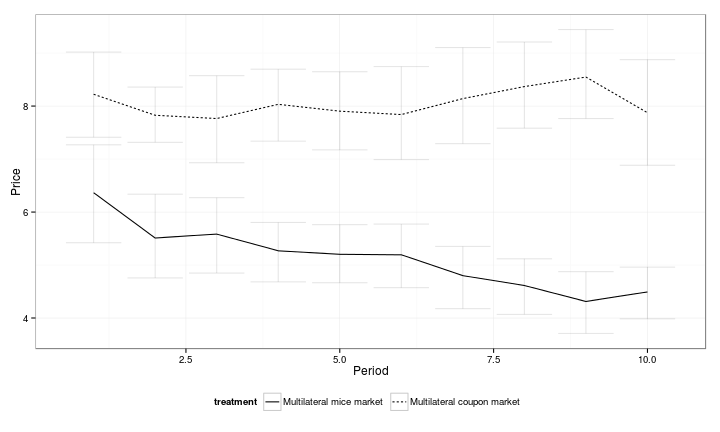

Falk, Szech: Morals and Markets
========================================================


```r
# Data from http://www.cens.uni-bonn.de/experiments/falk-szech This is the
# data from the paper at
# http://www.sciencemag.org/content/340/6133/707.full.pdf Title: Morals and
# Markets Feel free to fork, play around and improve.
require(foreign)
# Data in proprietary Stata format, can be pulled from the authors' website
Fig1.dta = read.dta("http://www.cens.uni-bonn.de/experiments/falk-szech/fig1.dta")
Fig2.dta = read.dta("http://www.cens.uni-bonn.de/experiments/falk-szech/fig2.dta")
tab_s1.dta = read.dta("http://www.cens.uni-bonn.de/experiments/falk-szech/tab-s1.dta")

# Alternatively, the same data is included in the repository (as of Nov.
# 20th, 2013) and can be used directly, should the need arise save(Fig1.dta,
# Fig2.dta, tab_s1.dta, file='original_data.RData')
# load('original_data.RData')
table(Fig1.dta)
```

```
##                       treatment
## option_b               Individual Bilateral market Multilateral market
##   rejected for 10\x80          67               10                  13
##    accepted for 10\x80         57               26                  41
```


Figure 1
------

```r
require(ggplot2)
theme_set(theme_bw())  # Simple backgrounds
####################### Fig 1 Fig1.dta$option_b = as.factor(Fig1.dta$option_b) Fig1.dta$treatment
####################### = as.factor(Fig1.dta$treatment)

p = ggplot(Fig1.dta, aes(x = treatment, fill = option_b, ))
p = p + geom_bar(position = "fill")
# p = p + geom_errorbar() # see for details:
# http://docs.ggplot2.org/0.9.3.1/geom_errorbar.html p = p + guides(fill =
# guide_legend(reverse = FALSE))
p = p + scale_fill_grey()
p = p + ylab("Fraction") + xlab("")
p = p + theme(legend.position = "none")
print(p)
```

 


Figure 2
-------


```r
####################### Fig 2
require(ggplot2)
require(Hmisc)
require(plyr)  # to do some data processing, i.e. group wise aggregations, we use plyr
# http://stackoverflow.com/questions/14284189/ggplot-not-drawing-connection-lines-between-group-means-any-more
Fig2.processed = ddply(Fig2.dta, ~period + treatment, function(x) mean_cl_boot(x$trade_price))
p = ggplot(Fig2.processed, aes(x = period, y = y))
p = p + geom_line(aes(linetype = treatment))
p = p + geom_errorbar(aes(ymin = ymin, ymax = ymax), alpha = 0.1)
p = p + scale_fill_grey()
p = p + ylab("Price") + xlab("Period")
p = p + theme(legend.position = "bottom")
# p = p + ylim(c(0,10)) + xlim(c(1,10))
print(p)
```

 


